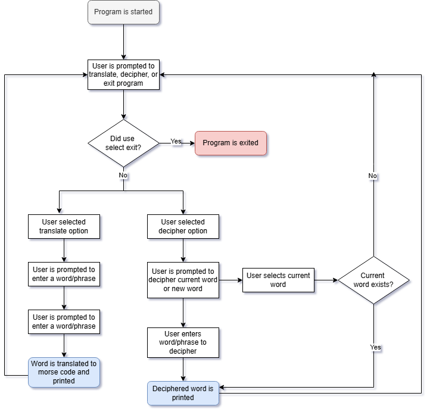

# 100 Days of Code Day 82: Morse Code CLI Program
## Project Walkthrough
This CLI morse code program is capable of translating plaintext into morse code as well as deciphering morse code text.

The program exists within a loop that prompts the user to enter one of the following options:
-	Translate a word into morse code
-	Decipher morse code
-	Exit the program

Of the three options, **exit** is self-explanatory and exits the program.

If the user chooses to **translate** a word or sentence into morse code, the text that is passed through is converted to morse code, printed and saved to a variable called **morse_code_word**.

If the user selects the **decipher** option, they have two sub options. Decipher current word or decipher a new word. If the user selects the decipher current word option, the word saved to the **morse_code_word variable** is deciphered into human readable text. If the user selects the decipher a new word option, they are prompted to enter morse code to decipher which is then printed on the screen. Both options save the deciphered word to the **deciphered_word variable**.

This process repeats until the user selects the exit option.
## Project Flowchart

